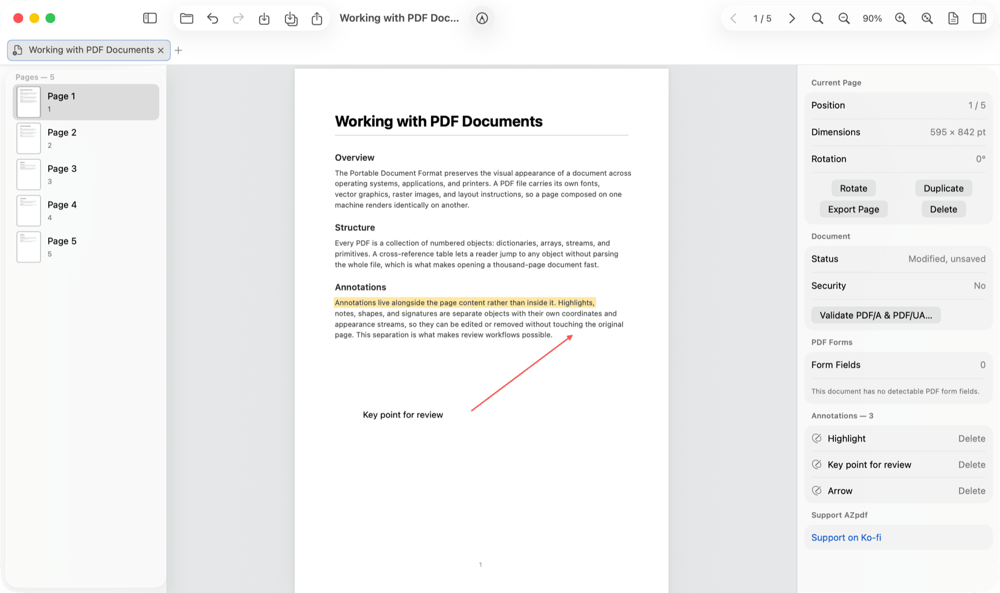
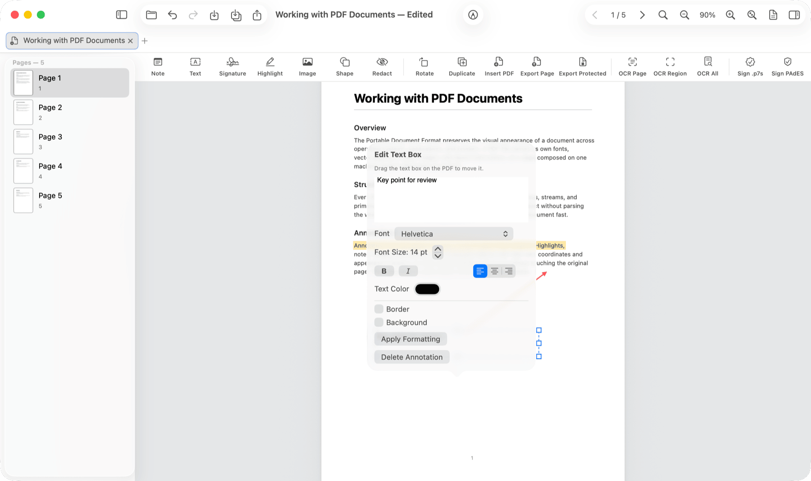

# AZpdf

**English** | [Tiếng Việt](README-VI.md)

An open-source, local-first PDF reader and editor. **v1.3.1 ships downloads for all three platforms** — macOS (signed and notarized), Linux (AppImage) and Windows (portable package). See [Download](#download--v131) for files and checksums. The Windows build is still a portable ZIP rather than an installer, and is not yet code-signed.







## In the first release
- Open, read, search, and navigate PDFs
- Open multiple PDFs in independent tabs without clobbering the document you are reading
- Navigate pages from the toolbar, the sidebar, or the `⌘[` / `⌘]` shortcuts
- Table of contents / PDF bookmarks in the sidebar whenever the document has an outline
- Fit-to-page zoom by default, with manual zoom controls and a Fit Page control to get back
- Search with a result count and previous/next result navigation
- Page thumbnails, zoom, text selection
- Add notes and highlights to the selected text; rotate, delete, duplicate, and reorder pages
- Add text boxes (free-text annotations) through a native sheet, with font, size, bold/italic, alignment, border, and background controls
- Draw a handwritten signature and insert it as a real PDF ink annotation
- Insert shapes: rectangle, oval, line, arrow, star, triangle — each is written as a standard PDF annotation subtype (Square, Circle, Line, Ink), so other readers render it correctly instead of showing an empty box
- Edit annotations directly on the object: click to select (a dashed frame for text boxes), drag handles to resize, a popover anchored to the object for its properties; arrow keys to nudge, Delete to remove
- Manage and delete the page's annotations from the Inspector, with undo
- Insert all pages from another PDF to merge documents (with undo)
- Insert images directly onto the page; drag to move, drag a corner handle to resize (aspect ratio preserved), saved as a durable stamp annotation
- Print (`⌘P`) through the system print dialog; annotations are included, and rotated pages come out the right way up
- Export the current page as a separate PDF
- Open password-protected PDFs with a native, on-device prompt
- OCR a drag-selected region, the current page, or the whole document through a hybrid local-first pipeline: the PDF text layer is preferred, with Apple's Vision framework at 3× render scale for scanned pages; review, edit, copy, or export the result as `.txt`. Pages carrying a region OCR could not read — a formula, a chart — are flagged in the review list rather than passed off silently: measured, all three engines we tested destroy mathematical notation, and Vision reports full confidence while doing it
- Export a password-protected copy through the native Save panel
- Redact the selection destructively: the page is rasterized and the original content is removed from the page's content stream
- Detect PDF forms; type directly into native widget fields in the document
- Validate PDF/A and PDF/UA with a local veraPDF runtime when available; the target profile is read from the document's XMP metadata, falling back to PDF/A-1b. The veraPDF report is shown verbatim — AZpdf never declares a document compliant on its own
- Undo/redo for up to 50 editing operations per session
- Unsaved-changes state clearly shown in the title bar and the Inspector
- Up to 8 recent documents for quick reopening
- Drag and drop a PDF onto the window to open it
- Save in place or export a new PDF
- English and Vietnamese interface; pick the language in Settings and it applies immediately, no relaunch

## Download — v1.3.1

Three installers, one version. Verify what you downloaded before running it.

| Platform | File | Size | SHA-256 |
|---|---|---|---|
| **macOS** 14+ | `AZpdf-macOS-1.3.1.zip` | 52 MB | `aa17eec6e62a3d312f73c58053dc49632b8b23fff2cb5322ba064720fff70d5c` |
| **Linux** x86_64 | `AZpdf-x86_64.AppImage` | 176 MB | `ae8b188f1f3d9cd708fdb7009d0f0e772fe55fa86ef4fdf63fdd19c10205de43` |
| **Windows** x64 | `AZpdf-Windows-x64-1.3.1.zip` | 91 MB | `e160e4b547f86e109611b952f6e07f2a3f361f6f8756c1e12b20bcc313d25db0` |

```bash
shasum -a 256 AZpdf-macOS-1.3.1.zip      # macOS
sha256sum AZpdf-x86_64.AppImage          # Linux
```

**macOS** is signed with a Developer ID and notarized by Apple, so it opens with no Gatekeeper
warning. **Linux**: `chmod +x AZpdf-x86_64.AppImage && ./AZpdf-x86_64.AppImage`; x86_64 only, no
arm64 build yet. **Windows** is a portable ZIP, not an installer — unzip it anywhere and run
`AZpdf.exe`. It is **not code-signed**, so SmartScreen will warn on first run; check the SHA-256
above before choosing to continue.

### What each platform ships

Not every platform carries every runtime, and the difference is deliberate rather than an
oversight. "Bundled" means it works out of the box. "Optional" means the feature is present but needs the
tool installed on your machine — AZpdf finds a Homebrew install automatically, and tells you
exactly what to install if it can't.

| | macOS | Linux | Windows |
|---|---|---|---|
| Read, annotate, sign, edit pages | ✅ bundled | ✅ bundled | ✅ bundled |
| OCR | ✅ Apple Vision, built in | ✅ bundled OCRmyPDF | ❌ not in v1 |
| Export a searchable PDF | ⚙️ optional — `brew install ocrmypdf` | ✅ bundled | ❌ not in v1 |
| Validate PDF/A · PDF/UA | ⚙️ optional — `brew install verapdf` | ❌ not bundled | ❌ not in v1 |

The macOS download does not bundle veraPDF or OCRmyPDF, and that is a size decision rather than
a missing feature: the veraPDF runtime measures **413 MB, of which 380 MB is the bundled JRE** —
nine times veraPDF itself — for one narrow feature. Packaging OCRmyPDF for macOS additionally
requires Tesseract, Ghostscript and qpdf built from source, since the release may not ship
Homebrew binaries. Install either with Homebrew and AZpdf picks it up on the next launch.

On Windows neither is available in v1: the three OCRmyPDF native dependencies are installer-based
there with no portable recipe yet.

## Privacy and plugins

- **Local-first:** AZpdf never uploads your PDFs, their contents, passwords, or your document history to any server.
- CI scans the source to block networking APIs in the app and core targets. On every run it also plants a real `URLSession` violation and fails the build unless the scanner catches it — a gate that quietly stopped scanning cannot pass as green.
- **Plugin-ready:** OCR, translation, and summarization will ship as optional installable plugins; AZpdf itself depends on no cloud service.
- Plugins are only discovered locally at `~/Library/Application Support/AZpdf/Plugins/`; see [Plugins/README.md](Plugins/README.md) and the [sandbox model](docs/PLUGIN_PROTOCOL.md). v1 does not run third-party binaries.
- **OCR to searchable PDF:** after reviewing the preview, you can export a new PDF through OCRmyPDF in a mode that preserves the original text layer. The Linux alpha bundle ships a portable OCR runtime with Tesseract, Ghostscript, qpdf, and `vie`/`eng`/`osd` language data; on macOS, OCR itself uses Vision; searchable-PDF export additionally uses OCRmyPDF when its runtime is bundled or installed. Before writing that file AZpdf warns you if any page was flagged as unreadable, because a searchable PDF bakes the current text in permanently.

## Support the project

AZpdf is free under AGPL-3.0. If it is useful to you, you can [support the author on Ko-fi](https://ko-fi.com/h3nryng).

Or scan the VietQR code to donate directly in Vietnam:


## Development

### macOS

Requires macOS 14+ and Xcode 26. Run `./script/build_and_run.sh`; CI uses `./script/build_and_run.sh --bundle` to build the `.app` without opening the GUI. When running from source, install MuPDF (`brew install mupdf`) for image insertion and veraPDF (`brew install verapdf`) for conformance validation. Release builds must pass `MUTOOL_RUNTIME_DIR` and `VERAPDF_RUNTIME_DIR` pointing at self-contained runtimes with vetted licenses and Hardened Runtime compatibility; the release script refuses to bundle without them.

Release packaging uses a Developer ID Application identity, Hardened Runtime, and notarization; see the [macOS release guide](docs/MACOS_RELEASE.md). AZpdf supports detached CMS/PKCS#7 signatures (`.p7s`) using certificates from the user's keychain, and embedded PAdES signing from a local PKCS#12 (`.p12`/`.pfx`). Baseline B, LT, and LTA profiles are available; LT/LTA require a TSA URL and still need testing against production trust stores/OCSP/CRL before use on long-term legal documents.

macOS releases ship with [third-party license notices](THIRD_PARTY_NOTICES.md) and an SPDX SBOM matching the bundled runtimes.

### Linux (v2 alpha)

See [Download](#download--v131) for the file and its checksum. The engine (MuPDF 1.28.0, OCRmyPDF, pyHanko) is self-contained and runs in a clean Ubuntu
24.04 container; the Flutter shell, like every Flutter Linux app, dynamically links GTK3 and
OpenGL, so it needs four system libraries: `libgtk-3-0t64` (or `libgtk-3-0` on older
distributions), `libegl1`, `libgl1`, `libgles2` — e.g.
`sudo apt-get install -y libgtk-3-0t64 libegl1 libgl1 libgles2`. Any GTK desktop (GNOME,
XFCE, Cinnamon, MATE) already has them; only a minimal system or bare container needs to
install them, plus a display server. An SPDX SBOM ships beside the download.

Linux uses a Flutter shell that talks to the same Swift core over JSON Lines IPC. The engine and runtimes (MuPDF 1.28.0, OCRmyPDF/Tesseract, pyHanko) are self-contained; health checks, OCR to searchable PDF, and PAdES Baseline B signing/verification all ran in an Ubuntu 24.04 container — the GUI shell needs the four GTK/GL libraries listed above. A development Flatpak on the Freedesktop 25.08 runtime has passed the sandbox probe, runtime health checks, and a GTK document-portal end-to-end test with real PDF fixtures; a reproducible public manifest for Flathub and real KDE portals are the next steps. The shell can display the document's reading order (`DocumentIR`) as an overlay on the page for review. See the [cross-platform shell guide](Shell/azpdf_desktop/README.md), the [UI/UX report](qa-report/azpdf-linux-shell-report-2026-07-18.html), and the [Ubuntu workstation QA](qa-report/azpdf-linux-workstation-report-2026-07-19.md).

Technical roadmap and Windows/Linux groundwork: [ROADMAP.md](ROADMAP.md), [docs/ARCHITECTURE.md](docs/ARCHITECTURE.md). Local plugin conventions: [docs/PLUGIN_PROTOCOL.md](docs/PLUGIN_PROTOCOL.md).

Local-first OCR direction: [docs/OCR_PLAN.md](docs/OCR_PLAN.md).

## License

AGPL-3.0-only. AZpdf is free to use, share, and improve — forever; modified distributions must publish their source under the same license. See the [official AGPL-3.0 text](https://www.gnu.org/licenses/agpl-3.0.html).
