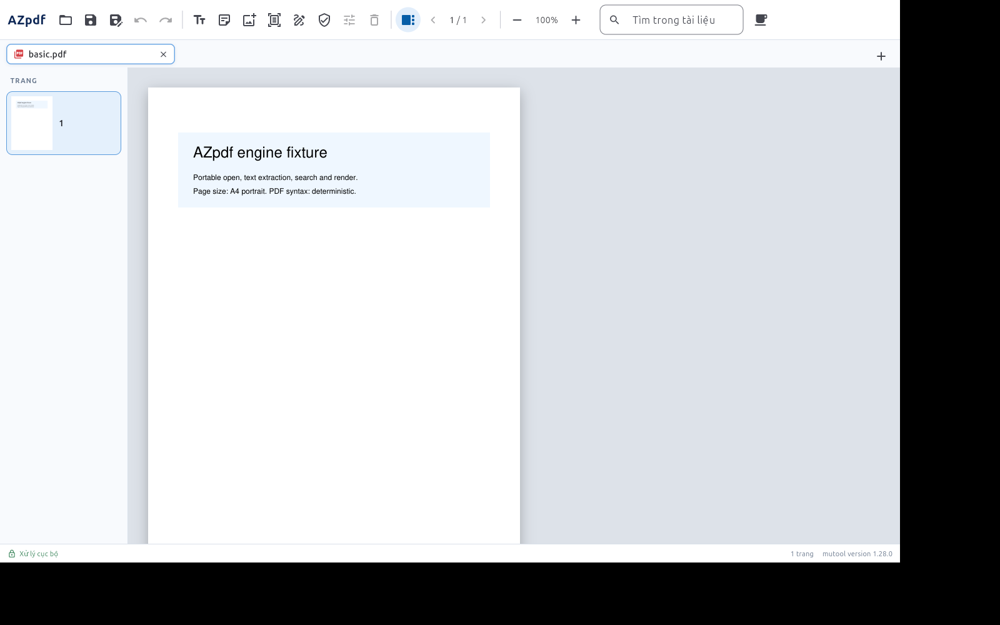
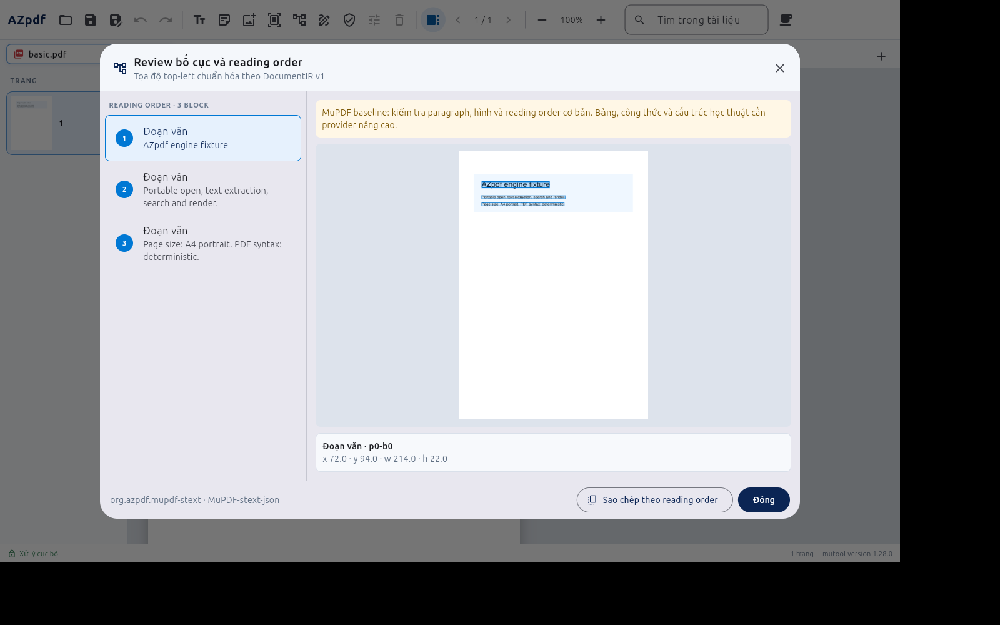
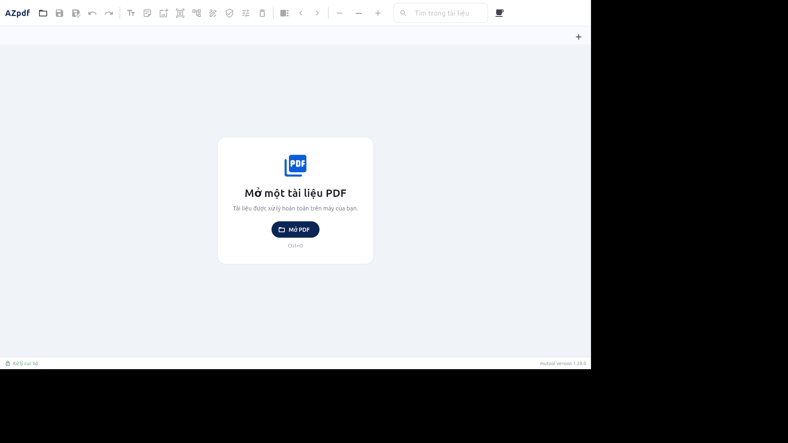
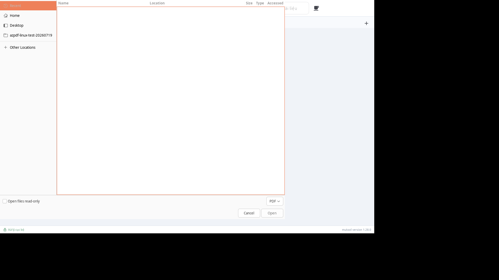
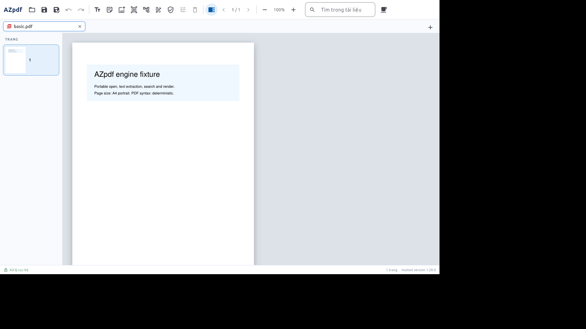

# AZpdf Linux workstation QA — 2026-07-19

## Môi trường

- Host: `<ubuntu-host>`, Ubuntu 24.04.4 LTS, kernel 6.14.0-37-generic, x86_64.
- Phần cứng thấy từ phiên SSH: 32 CPU, 61 GiB RAM.
- Flutter 3.44.0, Dart 3.12.0, Docker 29.6.2, Bubblewrap 0.9.0.
- Flatpak 1.14.6, flatpak-builder 1.4.2 và Freedesktop Platform/SDK 25.08 được cài ở user scope; không thay đổi policy AppArmor toàn hệ thống.
- Source kiểm thử độc lập: `/home/<user>/azpdf-linux-test-20260719`.

## Kết quả

| Hạng mục | Kết quả |
|---|---|
| Dart formatter | Pass |
| Flutter analyzer | Pass, 0 issue |
| Flutter widget tests | Pass, 9/9 |
| Swift core/adapter tests | Pass, 54/54, 0 skip khi bật fixture thật |
| Flatpak runner unit tests | Pass, 5/5 trên x86_64 Linux: least-privilege staging, không `--host`, copy/cleanup output, portal fail-closed |
| MuPDF integration | Pass: open, text, search, render, annotation text/note/image, edit/move/remove |
| PAdES integration | Pass: ký Baseline B, verify, phát hiện sửa đổi |
| Linux Release build | Pass |
| Runtime audit | Pass: MuPDF, OCRmyPDF, pyHanko |
| Container Ubuntu sạch | Pass: read-only, không mạng, UID không đặc quyền |
| DocumentIR | Pass: baseline, validate, export text, review overlay/reading order bằng engine Release thật |
| OCR offline | Pass: tạo searchable PDF và trích xuất text |
| PAdES offline | Pass; certificate QA self-signed nên `untrusted` đúng dự kiến, integrity vẫn `valid` |
| GUI Xvfb | Pass: mở app, mở/render PDF, thumbnail/tab/status đúng |
| Ctrl+O | Pass: mở hộp thoại `Open File` |
| Flatpak sandbox probe E2E | Pass: input/request read-only, network và host file bị chặn, child không ghi bền vững ra ngoài output |
| Flatpak development package | Pass: build, AppStream compose, install user-scope và launch Release |
| Flatpak permissions | Pass: IPC + Wayland/fallback X11 + DRI; không network, host/home filesystem hoặc Flatpak D-Bus talk |
| Flatpak runtime health | Pass trong sandbox: MuPDF 1.28.0, OCRmyPDF 15.2.0+dfsg1, pyHanko 0.35.2 |
| Flatpak portal Open PDF | Pass trên GTK portal trong Xvfb biệt lập: `Ctrl+O`, chọn `basic.pdf`, render trang/thumbnail/tab và OCR screenshot xác nhận nội dung fixture |
| Flatpak source manifest | Pass kiểm tra development/least privilege; Flutter 3.44, MuPDF, Swift package và 136 Pub archive đều khóa checksum/commit |
| Flatpak source build | Đang xác minh: MuPDF 1.28.0 và Swift `azpdf-engine` đã compile offline; đã sửa đường dẫn tài nguyên ngoài sandbox và bổ sung cache `flutter_tools` offline; cần chạy lại bước Flutter cuối |
| SBOM/checksum | Pass: SPDX 2.3, 4.043 dòng, SHA-256 hợp lệ |
| ELF dependencies | Pass: không có `not found` |
| ELF hardening | Pass: PIE, NX stack, GNU_RELRO và `BIND_NOW` (Full RELRO) cho runner, engine và MuPDF |
| Local-first/portable-core audit | Pass |

Bundle Release hiện tại có kích thước khoảng 321 MiB; Flatpak app content khoảng 335,4 MB. Phiên bản runtime: MuPDF 1.28.0, OCRmyPDF 15.2.0+dfsg1, pyHanko 0.35.2 (CLI 0.4.0). Commit Flatpak local đã kiểm thử: `6a581f6995e5b0c5e50098f56f727bf7eec9bc236f7c3f24064b903a26f2a2e3`.

## Phát hiện cần xử lý

1. **Structured OCR sandbox trên Ubuntu 24.04:** Bubblewrap không khởi động được dưới policy mặc định của workstation. Host có `kernel.apparmor_restrict_unprivileged_userns=1`; probe tối thiểu lỗi `setting up uid map: Permission denied` hoặc `loopback: Failed RTM_NEWADDR: Operation not permitted`. Runner fail-closed thành `sandboxUnavailable`, không fallback unsandboxed. Hướng Flatpak đã qua unit test và probe E2E; gói hệ thống vẫn cần AppArmor profile phù hợp. Không nên tự chuyển Bubblewrap thành setuid.
2. **GUI Xvfb:** log có cảnh báo DRI3/EGL do display ảo không có GPU; app vẫn render đúng bằng software path. Đây không phải lỗi trên desktop KDE thật.
3. **Đóng gói public:** source manifest development đã build MuPDF và Swift engine từ source trong sandbox, không mạng. Lần chạy thực tế phát hiện và đã sửa hai lỗi reproducibility: tài nguyên tham chiếu ngoài manifest, và Flutter tự cập nhật `flutter_tools` không offline. Cần chạy lại Flutter/GUI để chốt pass. Public manifest vẫn cần thay source `type: dir` bằng commit/tag public; OCRmyPDF và pyHanko cũng phải được đóng thành module source đã pin trước khi đạt feature parity.
4. **Portal desktop thật:** GTK portal trong Xvfb đã đạt. Phiên KDE đang hoạt động không được tự động điều khiển/chụp để tránh lộ dữ liệu người dùng; cần chạy harness opt-in sau khi đóng nội dung riêng tư, đồng thời kiểm tra Save As.

## Bằng chứng

Không truy cập hoặc chụp desktop KDE thật để tránh thu thập nội dung riêng tư ngoài phạm vi kiểm thử.
